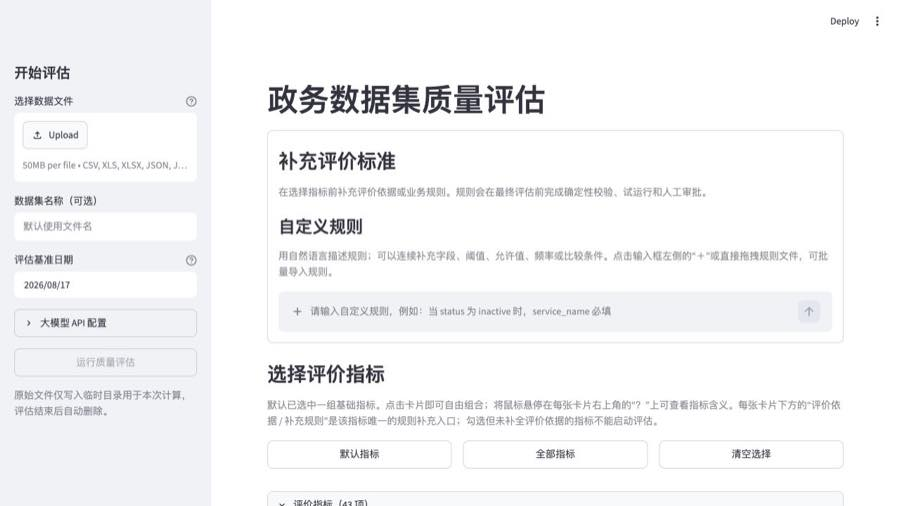
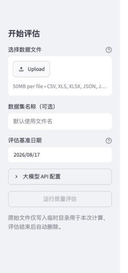
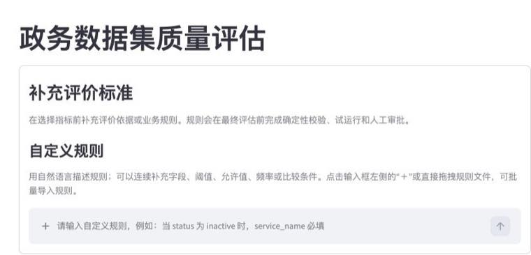

# 政务数据集质量评估 Demo

这是一个本地运行的数据集质量评估工具。上传一份政务数据集后，您可以选择评价指标、补充评价依据、用自然语言编写业务规则，并获得结构化的质量报告、风险提示和问题记录位置。

它适合数据目录建设、开放数据发布前检查、数据治理巡检，以及向业务人员演示“指标 + 规则 + 可审计结果”的质量评估流程。

## 功能一览

| 功能 | 可以做什么 | 页面位置 |
| --- | --- | --- |
| 数据集上传 | 读取表格、JSON 与 GeoJSON 数据，解析为可评估的单表数据集 | 左侧“开始评估” |
| 评估参数 | 设置数据集名称、评估基准日期，以及 Excel 工作表 | 左侧上传区下方 |
| 指标选择 | 按需勾选基础指标和标准指标，并查看每个指标的含义与计算方式 | 首页“选择评价指标” |
| 补充评价标准 | 为缺少业务口径的指标补充评价依据或规则 | 指标卡片内的“评价依据 / 补充规则” |
| 自定义规则对话 | 用中文自然语言描述业务规则，也可导入规则文件 | 首页顶部“补充评价标准” |
| AI 规则生成 | 将自然语言规则编译成受限、可校验的规则草案 | 提交规则后出现的预检区域 |
| 规则试运行与审批 | 在正式评估前检查规则影响范围，由用户明确确认后执行 | 规则草案下方 |
| 质量报告 | 查看风险、指标得分、字段画像、无法评估原因和运行信息 | 评估完成后的报告页 |
| 只读报告诊断 Agent | 概括结果、给出整改优先级、解释无法评估项，并回答报告问题 | 报告页“Agent 解读” |
| 报告下载 | 下载 JSON、Markdown 报告和疑似问题位置 CSV | 报告页底部 |
| 重新评估 | 保留当前数据集设置，返回首页补充规则或调整指标后再次评估 | 报告页顶部“重新评估数据集” |

## 支持哪些数据文件

在左侧“选择数据文件”中上传。单个文件上限为 50 MiB。

| 类型 | 支持的扩展名 | 使用说明 |
| --- | --- | --- |
| CSV | .csv | 适合常规二维表数据 |
| Excel | .xls、.xlsx | 可在上传后填写工作表名称；留空时读取第一个工作表 |
| 表格型 JSON | .json | 支持记录数组及常见的表格包装结构 |
| JSON Lines | .jsonl、.ndjson | 一行一条记录 |
| GeoJSON | .geojson | 支持 FeatureCollection，使用要素属性字段进行评估 |

当前不支持 ZIP 压缩包。请先解压后上传其中实际的数据文件。

## 页面导览与使用方法

### 1. 上传数据并设置评估参数

左侧栏是每次评估的起点。上传文件后，可以为报告填写一个更易识别的数据集名称；如果不填写，系统会使用文件名。对于与时间相关的指标，例如更新滞后，使用“评估基准日期”可以让同一份数据在不同时间重复评估时保持口径一致。

如果上传 Excel 文件，页面会额外显示“工作表名称（可选）”。当工作簿包含多个工作表时，填写目标工作表名称即可指定要读取的数据。

### 2. 配置可选的大模型 API

上传区下方的“大模型 API 配置”用于启用 AI 规则生成与报告解读。填写 API 地址、API Key 和模型名称后保存即可使用兼容 OpenAI Chat Completions 的服务。

模型并不是运行基础质量指标的前提条件：

- 未配置 API Key 时，Demo 可使用本地演示模板完成有限的规则交互。
- 已配置外部模型时，模型调用或返回格式出错会直接显示失败原因，不会伪装成成功的模型结果。
- 在 macOS 上，保存后的 API Key 会保存在当前用户的系统钥匙串中；用户可以在页面中主动清除它。

为保护数据，发送给模型的是经过白名单过滤的报告投影和脱敏字段画像，不包含上传文件中的原始单元格值。

### 3. 补充评价标准与自定义规则

首页最上方的“补充评价标准”位于指标卡片之前。这里包含“自定义规则”聊天框，适合把业务人员熟悉的自然语言要求直接交给系统理解。

聊天框支持连续补充：先描述规则，再补字段名、阈值、允许值或触发条件。点击输入框左侧的加号，或将文件拖入输入框，还可以一次导入多条规则。

规则导入支持 TXT、Markdown、CSV、Excel、JSON、JSONL 和 NDJSON。文本文件通常按非空行读取；表格可使用“规则描述”列并可选填写“指标 ID”列；导入后可在页面中逐条检查和修改。单个规则文件上限为 2 MiB。

系统当前覆盖的常见规则包括必填、条件必填、格式或正则、字符串长度、允许值、数值范围、更新频率和跨字段比较等。跨表参照、任意 Python 或 SQL、自动清洗、自动回写数据等超出 Demo 安全边界的要求会被明确拒绝。

### 4. 选择评价指标

规则区下方是“选择评价指标”。可以使用“使用默认指标”“全选”“清空选择”快速调整范围，也可以逐张勾选指标卡片。将鼠标悬停在卡片的问号图标上，可查看指标说明和当前可用的计算口径。

需要整体浏览目录时，展开该区域下方的“查看指标目录与计算方式”，即可在表格中查看指标名称、定义、计算方法和本地单表的当前可评价能力。

部分标准指标需要外部业务口径、数据标准或参照信息，单靠单表数据不能得出可靠结论。这类指标会在卡片内标明需要补充的内容，并提供“评价依据 / 补充规则”输入框。填写后，系统会将该内容作为对应指标的评价依据；如果内容涉及可执行业务规则，也可以让 AI 先生成规则草案。

“无法评估”不等同于得分为零。它表示当前数据和已提供的依据不足以支撑该项结论，报告会说明缺少什么。

### 5. 运行评估、规则预检和人工审批

不使用自定义规则时，上传文件、选择指标后点击“运行质量评估”即可。

使用聊天框或指标卡片补充了规则时，先点击“AI 检查并生成规则”。系统会依次完成：

1. 根据字段画像理解自然语言规则，并生成候选草案。
2. 校验字段是否存在、参数是否完整、规则类型是否在支持范围内。
3. 用当前数据进行试运行，展示规则可能影响的范围。
4. 要求用户填写审批人标识、勾选确认，再批准规则。
5. 仅在规则通过验证和人工批准后，用同一份数据重新计算质量报告。

批量导入规则采用“全部通过才执行”的方式：任一条规则不完整、无法解释或试运行失败时，系统不会悄悄只执行其余规则。修改数据文件、工作表、数据集名称、基准日期、指标选择或规则内容后，原有草案和审批会失效，需要重新检查。

~~~mermaid
flowchart LR
    A["上传数据集"] --> B["选择指标"]
    B --> C["补充评价依据 / 输入自定义规则"]
    C --> D{"是否需要生成规则？"}
    D -- "否" --> E["运行质量评估"]
    D -- "是" --> F["AI 生成候选规则"]
    F --> G["本地确定性校验与试运行"]
    G --> H["人工确认并批准"]
    H --> E
    E --> I["查看报告、下载或重新评估"]
~~~

## 评估结果包含什么

评估完成后，页面顶部会显示“重新评估数据集”按钮。它会带您回到设置页，并保留已选择的指标、指标卡片中的补充内容和规则对话，方便继续完善后再次运行。

报告首先展示记录数、字段数、已评估指标数、风险提示数和无法评估项数等摘要。下方提供以下标签页：

| 报告区域 | 内容 |
| --- | --- |
| 风险提示 | 按关注、提示、警告等等级展示风险数量和每条风险的说明、关联指标、字段和记录位置 |
| 指标明细 | 显示每一项指标的结果、得分、公式说明和评价口径 |
| 字段画像 | 展示字段类型、空值、唯一值、格式特征等概览，帮助理解数据结构 |
| 无法评估与运行信息 | 说明尚不能评估的指标、所需补充信息和本次运行状态 |
| Agent 解读 | 由用户主动触发的只读报告总结、整改建议和问答 |

风险图会根据当前关注、提示和警告的实际数量自动调整刻度，而不是把少量风险画成满格。

### 只读报告诊断 Agent

“Agent 解读”不会修改数据、指标选择、风险等级或已经计算出的结果。它只读取当前结构化质量报告，用于协助理解结果。页面提供以下快捷问题：

- 概括结果
- 优先整改事项
- 解释无法评估项

也可以在对话框中询问，例如“哪些字段最需要优先处理？”或“为什么这个指标无法评估？”。每次解读都由用户主动触发。

### 下载评估结果

报告页底部提供三种下载：

| 下载内容 | 适用场景 |
| --- | --- |
| 结构化报告（JSON） | 供其他系统、脚本或后续流程读取 |
| 评估报告（Markdown） | 供人直接阅读、归档或转发 |
| 疑似问题位置（CSV） | 定位到每项指标对应的记录序号，便于回到源数据处理 |

三种下载文件均不包含原始字段样例。疑似问题位置 CSV 中的记录序号从 1 开始，不包含表头行。

## 快速开始

### 运行环境

- Python 3.10 或更高版本
- 支持在本机运行 Streamlit
- 可选：一个兼容 OpenAI Chat Completions 的模型 API，用于 AI 规则生成和报告解读

### macOS 系统：配置与启动

1. 打开“终端”，进入项目目录。
2. 创建并激活虚拟环境：

~~~bash
cd /path/to/dataset_quality_demo
python3 -m venv .venv
source .venv/bin/activate
~~~

3. 安装依赖并启动 Demo：

~~~bash
python -m pip install -r requirements.txt
python run_demo.py
~~~

启动后，在浏览器打开终端显示的地址，通常是 http://127.0.0.1:8501 。在终端按 Ctrl+C 可停止服务。

### Windows 系统：配置与启动（PowerShell）

1. 打开 Windows PowerShell，进入项目目录。
2. 创建并激活虚拟环境：

~~~powershell
cd C:\path\to\dataset_quality_demo
py -3 -m venv .venv
.\.venv\Scripts\Activate.ps1
~~~

3. 安装依赖并启动 Demo：

~~~powershell
python -m pip install -r requirements.txt
python run_demo.py
~~~

如果 PowerShell 阻止激活脚本，可在当前窗口先执行：

~~~powershell
Set-ExecutionPolicy -Scope Process -ExecutionPolicy Bypass
~~~

启动后，在浏览器打开 PowerShell 显示的地址，通常是 http://127.0.0.1:8501 。在 PowerShell 按 Ctrl+C 可停止服务。

## 使用边界与数据安全

- Demo 只读取上传的数据并计算结果，不会修改、清洗或回写源文件。
- 原始上传文件仅在本次计算所需的临时目录中使用，评估结束后自动删除。
- 外部模型只用于理解和编译规则、解读报告；原始单元格值不会发送到模型服务。
- 模型不能自行批准规则或直接执行评估。规则是否生效始终经过本地校验、试运行和用户确认。
- 需要多表关联、权威参照、授权信息、服务等级协议或实际应用场景的指标，若没有相应依据会显示“无法评估”，不会给出虚假的合格结论。

## 常见问题

### 为什么点击运行后提示需要补充评价标准？

已勾选的某些指标依赖业务定义或外部证据，而当前数据本身无法提供这些信息。请在对应指标卡片填写“评价依据 / 补充规则”，或者取消勾选该指标后再运行。

### 为什么规则没有直接生效？

自然语言描述可能有歧义。系统会先让模型生成候选规则，再使用字段、参数和试运行结果进行本地校验。只有您明确批准后，规则才会参与正式评估。

### 可以一次导入很多规则吗？

可以。通过聊天框左侧加号或拖拽导入规则文件。导入后请逐条检查系统识别出的内容；如果任一条无法生成有效规则，整批规则需要先修正后才能批准。

### 报告中的“无法评估”是否表示数据不合格？

不是。它表示需要的评价条件尚未提供，不能据此判断好坏。请查看“无法评估与运行信息”中的说明，补充所需依据后重新评估。

### 如何运行自动化检查？

在已激活的虚拟环境中执行：

~~~bash
python -m unittest discover -s tests -q
~~~
